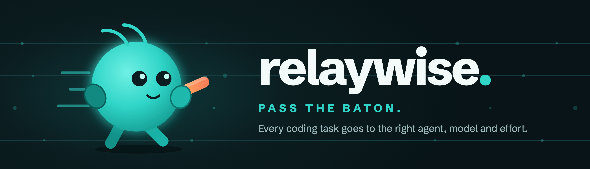

# relaywise 🏃 — the right coding agent for every task

<p align="center">
  
</p>

<p align="center">
  <a href="https://github.com/Sauhard74/relaywise/actions/workflows/ci.yml"></a>
  <a href="https://www.npmjs.com/package/relaywise"></a>
  
  <a href="https://github.com/Sauhard74/relaywise/pkgs/container/relaywise-runtime"></a>
  <a href="LICENSE"></a>
</p>

<p align="center">
  
</p>

relaywise is a terminal coding agent — and an API — that doesn't pick one AI model and hope.
For every request it chooses between **Claude Code, Codex, OpenCode and Hermes**, the model to run
them with, and how hard they should think, then runs the chosen agent in an isolated sandbox. Easy
tasks go to fast, cheap models; hard ones get a frontier model. The choice takes about a third of a
second, is made with TypeSafe's [Jev](https://typesafe.ai) model, and is explained every time.

## Quickstart

You need Docker and Node 22+.

```bash
npm install -g relaywise
relay up                  # asks for your API keys once, then starts relaywise in Docker
cd ~/code/your-repo
relay
```

Ask for a change the way you would with any coding agent. Your files are copied into a sandbox,
the agent works there, and its changes come back to your repo as ordinary uncommitted edits you
can review with `git diff`.

## What you get

- **The right agent per task.** Each request is matched to an agent, model and effort level based
  on what it is and how hard it is. On our 40-task benchmark the choice matches the right tier
  90–95% of the time, at an estimated 40% less than always using the top model.
  [How routing works →](docs/routing.md)
- **You stay in control of cost.** Optimise for `cheapest`, `balanced` or `best`, set a budget per
  request, and see the estimate before anything runs.
- **Memory that survives switching models.** Every turn is a git commit plus an entry in
  `.relay/MEMORY.md`, so when a follow-up goes to a different agent it picks up exactly where the
  last one stopped — even in a new session.
- **Sandboxed by default.** One locked-down container per session; your API keys never enter the
  container's configuration.
- **It learns.** Tell it whether a run worked, and future routing for similar tasks improves.
- **A dashboard and an API too.** See where every task went at `http://127.0.0.1:8420/dashboard`,
  or call it from your own app — it speaks the same API as [HarnessRouter](https://harnessrouter.ai),
  plus automatic routing. [API reference →](docs/api.md)

## Using `relay`

| Command | What it does |
|---|---|
| `relay` | Interactive session in the current directory |
| `relay -p "task"` | Run one task and exit — for scripts and CI (`--json` for machine-readable output) |
| `relay up` | Start the local relaywise service (asks for keys the first time) |
| `relay down`, `relay logs` | Stop it, or follow its logs |
| `relay status` | Show which agents are ready |

Inside a session:

| Command | What it does |
|---|---|
| `/route <task>` | See where a task would go and why, without running it |
| `/objective cheapest \| balanced \| best` | What to optimise for |
| `/budget 0.50` | Refuse anything estimated above this |
| `/harness`, `/model`, `/effort` | Pin a specific agent, model or effort level |
| `/diff`, `/undo` | Review or revert the last change |
| `/memory` | What happened so far in this project |
| `/new` | Fresh conversation — still briefed from the project's memory |

`esc` stops a running task; `ctrl+c` twice quits.

## Using your subscriptions

- **Claude:** run `claude setup-token` and give `relay up --reconfigure` the token.
- **ChatGPT (Codex):** run `CODEX_HOME=~/.codex-relaywise codex login` once; `relay up` picks it up.
- **OpenCode and Hermes** use an [OpenRouter](https://openrouter.ai) key.

## Learn more

- [How routing works](docs/routing.md) — the decision, the scoring, and benchmark results
- [HTTP API](docs/api.md) — endpoints, sessions, projects and memory
- [Architecture and development](docs/architecture.md) — how it's built, security model, running from source, releasing

## Roadmap

File uploads through the API, cloud sandboxes (E2B, Vercel Sandbox), per-team budgets, and a
learned ranker trained on the outcomes relaywise records.

## License

[Apache-2.0](LICENSE)
